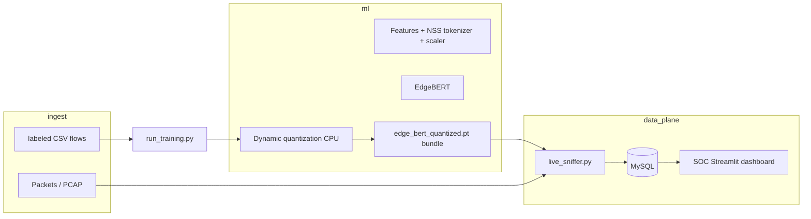

# NetShield AI — Technical deep dive

This document explains **how the project fits together**, **non-obvious behavior**, and **how to evaluate the model** offline. Paths are relative to the repository root (the folder containing `soc_dashboard.py`).

---

## 1. High-level architecture

The system is designed as an end-to-end pipeline:



| Layer | Role |
|-------|------|
| **Data** | CICIDS-style CSVs (`data/*.csv`) for training; live packets via Scapy for inference. |
| **Features** | **4 numbers per timestep** over a sliding window of **5** flows: protocol ID token, destination-port token, scaled flow duration, scaled packet rate. |
| **Model** | **EdgeBERT**: embeddings + Transformer encoder blocks + extra self-attention block for **explainable attention** tied to SOC XAI panels. |
| **Artifact** | `edge_bert_quantized.pt` — usually a dict bundle: `model` (quantized module), `tokenizer_state`, `scaler`. |
| **Persistence** | MySQL tables (`alerts`, `alert_xai`, `model_registry`, …). |
| **UI** | `soc_dashboard.py` reads MySQL only (does **not** import PyTorch). |

---

## 2. Repository map (mental model)

| Path | Purpose |
|------|---------|
| `data_pipeline.py` | **NSSTokenizer**, **`NetworkBehaviorDataset`** (CSV → tensors, window size 5). |
| `model_engine.py` | **EdgeBERT**, `train_model` (binary BCE), `quantize_model` (dynamic `qint8` on `Linear`). |
| `run_training.py` | Builds dataset, trains, saves bundle, inserts **active** `model_registry` row. |
| `live_sniffer.py` | Scapy capture → per-flow aggregates → **same feature layout** → quantized inference → **`MySQLAlertSink`**. |
| `soc_dashboard.py` | Streamlit SOC: KPIs, map, alerts, XAI visualization from MySQL. |
| `sql/schema.sql` | Canonical DDL; applied by `init_db.py`. |
| `app/common/db.py` | SQLAlchemy engine/session from `.env`. |
| `app/common/mysql_password.py` | Resolves DB password from `MYSQL_PASSWORD` or `mysql.password` file. |
| `scripts/register_bundled_model.py` | Registers an imported `.pt` in `model_registry` without retraining. |
| `scripts/check_setup.py` | Environment validation (imports, optional MySQL, optional bundle load). |
| `attack_sim.py` | Demo: UDP blast + synthetic MySQL telemetry (does not validate model accuracy). |

---

## 3. Feature engineering (training vs live)

### 3.1 Column contract (CSV)

Defined in **`ColumnMapping`** (defaults):

- `Protocol` — IANA number (TCP=6, UDP=17, …).
- `Destination Port`
- `Flow Duration`
- `Flow Packets/s` *(treated as packet rate)*
- `Label` — must expose a row whose label string matches **`BENIGN`** (case-insensitive) for the binary mapper in training.

See `data/README.md`. If **`Protocol`** is absent, **`_ensure_protocol_column`** assigns **TCP (6)** to every row (convenience for some exports—not a substitute for real protocol data).

---

### 3.2 Network-as-a-Sequence (**NSSTokenizer**)

- **Protocols**: known IANA values from a fixed preference list (`_IANA_ORDER`) appear first in the vocab; unknown protocols encountered at `fit` time are appended in sorted order. At transform time unknown values map to **`unk`** (= last index).

- **Ports**: every distinct port seen during **`fit`** gets an ID (sorted enumeration). Unknown ports → **`unk`**.

- **Important**: Inference **must use the tokenizer state saved inside the `.pt` bundle**. If tokenizer/scaler are not aligned with training data, numeric IDs for the same literal port/proto can differ wildly from training — accuracy collapses.

---

### 3.3 Sliding windows (**NetworkBehaviorDataset**)

- Concatenates **all** `*.csv` files in the data directory in sorted filename order.

- Drops rows with invalid numerics (`NaN`/inf stripped for required numeric columns).

- Builds **stride-1** windows over **row indices**: window `k` uses rows `[k, k+1, …, k+4]`.

- **Label for a window** = label of **the last row** in that window (`y` taken from `_labels[rows[-1]]`).  
  ⇒ Adjacent windows are **highly correlated** (overlap 4 flows). Metrics that assume IID samples will **overstate confidence** unless you split by time/flow/session or deduplicate aggressively.

---

### 3.4 Continuous scaling

- **`MinMaxScaler`** is fit on **`[Flow Duration, Flow Packets/s]`** column-wise across **all concatenated rows** (after cleaning), then applied to produce two channels in `[0,1]` (per scaler semantics).

---

## 4. Model: **EdgeBERT** (`model_engine.py`)

### 4.1 Input tensor

Batch shape **`(batch, 5, 4)`**:

| Index | Meaning |
|------|---------|
| `[:,:,0]` | Protocol token IDs (clamp-fitted inside `Embedding` to valid range). |
| `[:,:,1]` | Destination port token IDs. |
| `[:,:,2]` | MinMax-scaled flow duration. |
| `[:,:,3]` | MinMax-scaled packet rate. |

### 4.2 Architecture (conceptual stack)

1. Separate **`Embedding`** modules for protocol and port tokens (each `DEFAULT_TOKEN_EMB_DIM = 32`; fused width `2*TE + 2` continuous dims).

2. **`Linear` fused projection** → `d_model = 128`.

3. Sinusoidal **positional encoding** + dropout (`max_len` keyed to seq length).

4. **`nn.TransformerEncoderLayer` × 3** (post-norm, `batch_first`, ReLU default in stack).

5. **`FinalSelfAttentionBlock`**: exposes **explicit attention weights** (`need_weights=True`, `average_attn_weights=False`) for XAI payloads.

6. **Pooling** default **mean over time**.

7. **Binary head**: `Linear(d_model → 1)` logits → **sigmoid only at inference** (training uses **`BCEWithLogitsLoss`**).

### 4.3 Quantization gotcha (`quantize_model`)

Training uses plain `Linear` layers inside `TransformerEncoderLayer`. **Dynamic quantization** replaces some FFN `Linear`s with quantized modules. **`nn.MultiheadAttention`’s “fast path”** can disagree with quantized FFN tensors. **`_mha_slow_path_if_quantized_ffn`** temporarily disables **MHA fast path** during forward passes when quantized FFN linears are detected — this is deliberate and **tiny performance cost vs correctness**.

Final block uses custom attention with explicit weights and is quantized via the same mechanism.

---

## 5. Training (`run_training.py`)

### 5.1 Binary label mapping (`_BinaryBenignAttackDataset`)

Multi-class **`Label`** strings are collapsed to binary:

- **Benign**: class index aligned to **`BENIGN`** in `dataset.label_mapping` → target **0.0**.
- **Everything else**: target **1.0** (“Malicious umbrella”).

**Implication**: “Accuracy” depends entirely on whether your CSV’s attack labels behave like this binary separation. Rare labels and imbalance dominate metrics.

Training loop: **`Adam`** + **`BCEWithLogitsLoss`** for **configured epochs**, then **`quantize_model`**, then **`torch.save`** bundle to **`edge_bert_quantized.pt`**.

### 5.2 Model registry

On success, training **deactivates** previous registry rows (`is_active=FALSE`) and **inserts** a new **`model_version`** with paths for artifact/tokenizer/scaler (often duplicate path string when bundled).

Dashboard helper reads **active version string** (`fetch_active_model_version` in `soc_dashboard.py`). **Alerts** store `model_version` as **`Path(model_path).name`** in `live_sniffer` (**filename**, not necessarily registry string).

---

## 6. Live inference (`live_sniffer.py`)

### 6.1 Artifact loading (`load_inference_artifacts`)

Supports:

1. **Dict bundle**: keys **`model`** + **`tokenizer_state`** (+ optional **`scaler`** else sidecar pickle).

2. **Raw `nn.Module` checkpoint** + **`nss_tokenizer.pt`** + **`nss_scaler.pkl`** alongside.

### 6.2 Flow key & aggregation

A flow is keyed by **`(src_ip, dst_ip, src_port, dst_port, ip_proto)`** (see `FlowKey`). Packets increment counters; features mirror training column semantics.

### 6.3 Packet rate denominator nuance

The first packet on a newly seen flow historically produced near-infinite rates (`max(duration, tiny)` heuristic). **`_MIN_WALL_SEC_FOR_RATE`** (0.05s floor) avoids spurious floods. **`_MAX_PACKET_RATE_SANITY`** caps absurd rates before model/heuristics run.

---

### 6.4 Model signal vs engineering heuristics

**Inference decision path**

1. **Model**: sigmoid(**logit**) > 0.5 ⇒ `"Malicious"`, else `"Benign"`. Confidence tracks **max(prob, 1−prob)** for display.

2. **`_apply_attack_heuristic`** (post-model, **live traffic only**) can **force Malicious / boost confidence ≥0.97** when:
   - last snapshot is **real** (`is_synthetic` false),
   - `packet_rate ≥ 150`, **and**
   - `destination_port ∈ {80, 443}`, **and**
   - L4-ish proto **6 or 17**.

Evaluate “pure ML accuracy” offline **without this heuristic**.

3. **`_monitor_capture_loop`**: If **no live packets ≥ ~3s**, code generates **benign-ish synthetic telemetry** marked `is_synthetic=True`. Synthetic-only sequences are **never stored as malicious** regardless of logits (SOC anti-spam safeguard).

---

### 6.5 Severity buckets (`MySQLAlertSink._calculate_severity`)

| Condition | Severity |
|-----------|----------|
| Prediction `Benign` | `Info` |
| Malicious + conf ≥ **0.95** + pkt/s > **100** | `Critical` |
| Malicious + conf ≥ **0.85** | `High` |
| Malicious + conf ≥ **0.70** | `Medium` |
| Otherwise malicious | `Low` |

Severity is **operational garnish**, not a calibrated probability.

---

## 7. MySQL schema (operational semantics)

|**Table**|**Role**|
|-----------|-------|
|`alerts`|Primary alert ledger (prediction, severity, IPs/ports, model_version string, SOC workflow columns).|
|`alert_xai`|JSON attention payload bound to `alert_id` (**CASCADE** delete).|
|`model_registry`|Versioning + filesystem paths (+ optional serialized metrics blob). Single **active** row expected for dashboard label.|
|`flow_rollups_1m`|Pre-aggregation hooks (populate elsewhere if extended).|
|`analyst_actions`|SOC actions bound to alerts.|

Timezone note: ingestion normalizes timestamps to naive UTC-compatible values before insert paths in `live_sniffer`.

---

## 8. SOC dashboard (`soc_dashboard.py`)

- **Reads only from MySQL** through `get_db_session`. No Torch → dashboard can stay up while GPU/CPU inference is elsewhere.

- **Caching**: Streamlit **`@st.cache_data`** TTLs keep queries cheap; restarting Streamlit resets caches.

- XAI plotting pulls **`alert_xai.attention_json`** → reduced tensors for visualization (aggregation rules handle several rank shapes).

---

## 9. Windows / runtime sharp edges

| Topic | Detail |
|-------|--------|
| **Npcap vs Nmap** | **Scapy** needs **Npcap** (often installed with WinPcap API compatibility). Nmap alone is **not sufficient** unless Npcap is present. |
| **Elevation** | Raw capture commonly requires **Run as Administrator**. |
| **PyTorch DLL `WinError 1114`** | Usually ** MSVC++ 2015–2022 Redistributable (x64)** missing/corrupted. **`fix_pytorch_windows.bat`** in repo automates repair + CPU wheel reinstall. |
| **`cmd.exe` activation** | `Activate.ps1` is **PowerShell-only**. Prefer `venv\\Scripts\\python.exe -m streamlit …` or `venv\\Scripts\\activate.bat`. |
| **Paths** | Run training/sniffer/dashboard from repo root so `edge_bert_quantized.pt` resolves consistently. |

---

## 10. How to evaluate **accuracy** (offline)

The repository **does not ship a dedicated evaluator script**. You measure accuracy against **labeled windows** identical to **`NetworkBehaviorDataset`**.

### 10.1 What “ground truth” is

Training treats:

- **`BENIGN` label** ⇒ class **0**.
- Any other CSV label ⇒ class **1** (attack umbrella).

Accuracy “with respect to CSV” matches that convention.

### 10.2 Pitfalls before you trust a number

1. **Temporal / window leakage** — adjacent overlapping windows violate independence. Prefer **blocking splits by time**, **attack flow ID** if present, or **keep only every 5th window** as a cheap decimation hack.

2. **Distribution shift** — Live traffic feature stats differ from CIC CSVs ⇒ offline accuracy ≠ production precision.

3. **Heuristic override** — For raw ML logits only, replicate **`EdgeBERTInferenceRunner.run`** thresholds (0.5) and **omit** **`_apply_attack_heuristic`** or label rows **before** heuristic when comparing to labels.

### 10.3 Minimal evaluation logic (conceptual Python)

Rough outline you can paste into `scripts/eval_holdout.py` (not shipped):

```python
# Pseudocode sketch — assumes project root on PYTHONPATH
import numpy as np
import torch
from sklearn.metrics import classification_report, roc_auc_score
from pathlib import Path
from torch.utils.data import DataLoader, Subset
from sklearn.model_selection import train_test_split

from data_pipeline import NetworkBehaviorDataset
from model_engine import EdgeBERT

data_dir = Path("data")  # or TRAINING_DATA_DIR
ds = NetworkBehaviorDataset(data_dir)
idx = np.arange(len(ds))
train_i, test_i = train_test_split(idx, test_size=0.2, shuffle=True, random_state=42)  # see leakage caveat

subset = Subset(ds, test_i)
loader = DataLoader(subset, batch_size=256, shuffle=False)

# IMPORTANT: vocab sizes MUST match tokenizer inside saved bundle loader for quantized eval.
# Easiest parity test: instantiate EdgeBERT(protocol_vocab_size, port_vocab_size) same as dataset,
# load non-quantized weights if you snapshot them BEFORE quantize_model (not persisted by default),
# OR eval using EdgeBERTInferenceRunner on CPU with quantized weights (forward path differs slightly).

model = EdgeBERT(ds.tokenizer.protocol_vocab_size, ds.tokenizer.port_vocab_size).eval()

ys, ps = [], []
with torch.no_grad():
    for x, y in loader:
        logits, _ = model(x)
        prob = torch.sigmoid(logits.view(-1)).numpy()
        ps.append(prob)
        ys.append((y.numpy() != 0).astype(np.int64))  # benign id may not be zero — map via label_mapping

probs = np.concatenate(ps)
labels = np.concatenate(ys)

print(classification_report(labels, probs > 0.5, digits=4))
try:
    print("ROC-AUC", roc_auc_score(labels, probs))
except ValueError:
    print("ROC-AUC undefined (single class in slice)")
```

### 10.4 Evaluating the **saved quantized** bundle faithfully

Closest to production inference:

```python
from pathlib import Path
from live_sniffer import load_inference_artifacts, EdgeBERTInferenceRunner, FlowFeatureSnapshot

arts = load_inference_artifacts(Path("edge_bert_quantized.pt"))
runner = EdgeBERTInferenceRunner(arts)
# Fabricate Snapshot lists length 5 or adapt dataset tensors -> FlowFeatureSnapshot (reverse scaler + token decode)
```

Converting **`NetworkBehaviorDataset` tensors → `FlowFeatureSnapshot`** requires **invert MinMaxScaler** on duration/rate channels and interpreting token IDs → raw proto/port (IDs suffice if you refactor runner to bypass pandas path). Practical approach: replicate **`EdgeBERTInferenceRunner.run`** numeric path directly from tensors on CPU.

---

## 11. Security & ethics notes

- **`attack_sim.py`** sends volumetric UDP to a chosen target IP (**default `8.8.8.8`**). Use only labs you legally control.

- Alerts may contain IPs from your own network monitoring — classify storage & access accordingly.

- Quantization slightly perturbs logits; expect **fractional ROC drift** versus float32 baseline.

---

## 12. Quick operational checklist

1. `.env` + `mysql.password` (or inline `MYSQL_PASSWORD`) consistent across `init_db`, dashboard, sniffer.
2. `python init_db.py` once per environment.
3. `edge_bert_quantized.pt` at repo root (+ optional `scripts/register_bundled_model.py` for SOC label).
4. `python scripts/check_setup.py --mysql`
5. `python -m streamlit run soc_dashboard.py`
6. Admin shell + working Npcap + `venv\Scripts\python.exe live_sniffer.py [--iface ...]` for live ingestion.

---

## 13. Glossary

| Term | Meaning here |
|------|----------------|
| **NSS** | *Network Sequence Semantics* style token mapping (prot/port vocab). |
| **XAI** | Attention weights serialized to **`alert_xai`**. Not SHAP-LIME replacements; interpretation is qualitative. |
| **Bundle** | Torch save dict bridging model weights + tokenizer + scaler for deployment portability. |

---

*Last synthesized from the codebase layout (training, quantization, ingestion, SOC). Extend this file alongside architectural changes.*
